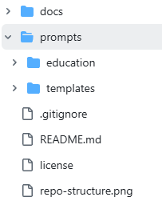

# prompt_lab
A personal prototype exploring how LLM-powered prompts can support learning and career development. Focused on building a Career Coach to practice prompt engineering and experiment with applications in education.

# Contents
- /prompts – example prompts & templates
- /apps – small tools & generators
- /workshops – training materials

# Quickstart (placeholder)

# Week 1 Plan
See issue: plan: week 1
